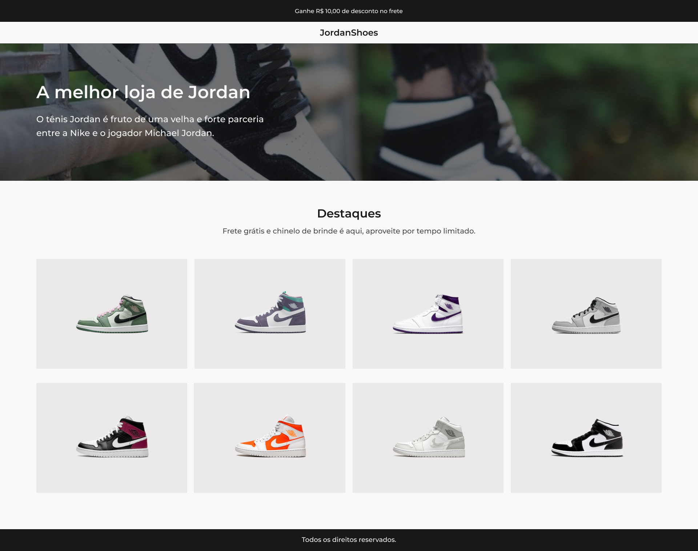

  

## 🧪 Tecnologias

Para o desenvolvimento deste site foram utilizadas as seguintes tecnologias:

- HTML
- CSS
- Git/GitHub

 

## 💻 Projeto

Criação de um site semântico e responsivo.

Este é um projeto desenvolvido a partir do desafio da comunidade [@Codelândia](https://discord.com/invite/QevDJqCzaY), para treinar minhas habilidades técnicas como Front-end.

[**Clique aqui para vizualizar o projeto**](#)

 

## 🔖 Layout

Você pode visualizar o layout do projeto através dos links abaixo:

- [Layout Web](https://www.figma.com/file/Yb9IBH56g7T1hdIyZ3BMNO/Desafios---Codel%C3%A2ndia?node-id=1883%3A2&t=Y4XJfRj6XXX2kQ6Q-0)

Lembrando que você precisa ter uma conta [Figma](http://figma.com/) para acessá-lo.

 

## ✉️ Contato

ciavug@gmail.com
